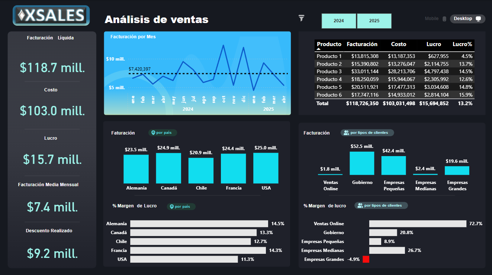
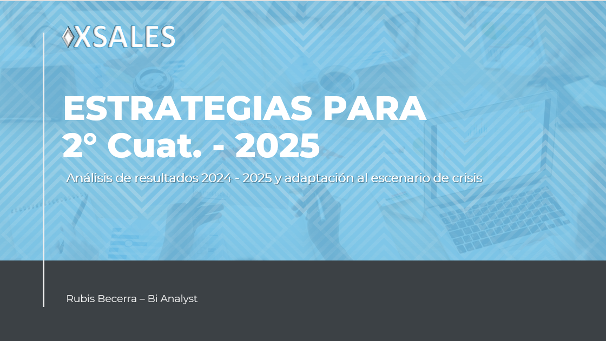

# 📊 Análisis de Ventas y Facturación | Dashboard Power BI y Presentación Ejecutiva PowerPoint

### - Ver Dashboard Interactivo
👉 https://app.powerbi.com/view?r=eyJrIjoiZTcyZjcwYmUtZWYyNy00YmFhLWJjYWMtNjJmM2Q2YmExYjIxIiwidCI6Ijc3MDI2YzQzLTFmNWMtNDEyYy1iNjg1LTJkNTM4Y2Q4NWIzMCIsImMiOjR9

### - Ver Tabla de Medidas en DAX
👉 https://github.com/Rubis-Becerra/Dashboard-y-Presentacion-Analisis-de-Ventas-y-Facturacion/blob/main/Dasboard_Analisis_Ventas.SemanticModel/definition/tables/Tabla%20Medidas.tmdl

### - Ver Presentación Ejecutiva en PowerPoint 
👉 https://github.com/Rubis-Becerra/Dashboard-y-Presentacion-Analisis-de-Ventas-y-Facturacion/blob/main/Presentacion_Analisis_Ventas.pptx

---

## 🧠 Contexto del Proyecto
Análisis de Ventas para XSales una empresa presente en 5 países con sedes físicas, su principal actividad es ofrecer soluciones de redes y comunicaciones en entornos corporativos y está presentando una disminución de ganancias/lucro significativa. El repositorio incluye un dashboard interactivo y una presentación ejecutiva en PowerPoint, orientados a analizar el desempeño comercial del negocio, detectar insights clave y proponer acciones estratégicas priorizadas para el segundo cuatrimestre del 2025.

---

## 🎯 Objetivos del Análisis
- Evaluar el rendimiento comercial y la rentabilidad.
- Identificar oportunidades de mejora y crecimiento.
- Priorizar recomendaciones estratégicas para el 2° cuatrimestre del 2025 según impacto y viabilidad.

---

## 🛠️ Herramientas Utilizadas
- **Power BI**: modelado de datos, visualizaciones e interacción.
- **DAX**: métricas de facturación, costos, lucro y margen, con análisis por tiempo, producto, país y tipo de cliente.
- **Excel / CSV**: fuente de datos.
- **GitHub**: documentación y portfolio.

---

## 📸 Views
### Dashboard

### Presentación

---

## 📈 KPIs y Métricas Analizadas en el Dashboard
- Facturación total.
- Costos.
- Lucro (beneficio).
- Margen de ganancia.
- Facturación promedio mensual.
- Descuentos realizados.

## 📈 Presentación ejecutiva
La presentación en PowerPoint traduce los resultados del dashboard en un lenguaje ejecutivo, abordando:

- Interpretación de resultados clave.
- Principales insights del análisis.
- Identificación de oportunidades de negocio.
- Análisis de impacto esperado de cada acción propuesta.
- Recomendaciones estratégicas priorizadas.

---

## 👩🏻‍💼 Sobre mí
Soy **Ingeniera Civil con experiencia en gestión de proyectos**, actualmente en transición al mundo de **Data Analytics & Business Intelligence** y estudiante de **Ciencia de Datos**.  
Mi enfoque combina análisis de datos con **visión de negocio y toma de decisiones estratégicas**.

📫 **Contacto**
- **LinkedIn**: *www.linkedin.com/in/rubis-becerra*
- **Portfolio Power BI**: *(agregar link)*
- **GitHub**: *https://github.com/Rubis-Becerra/Dashboard-y-Presentacion-Analisis-de-Ventas-y-Facturacion*

💼 **Abierta a oportunidades laborales en posiciones de Analista de Datos y Business Intelligence**.
